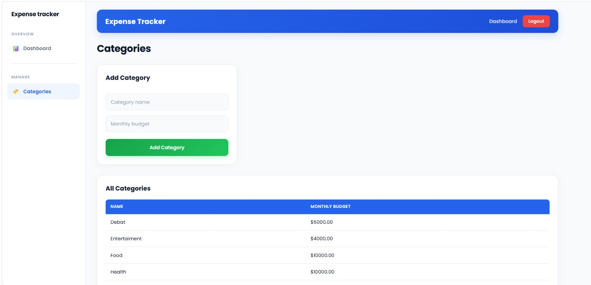
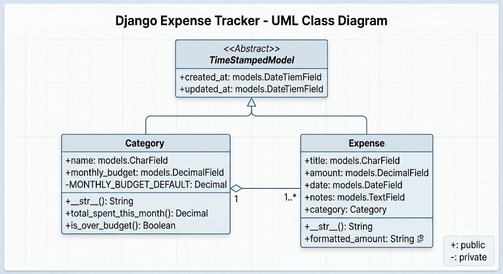
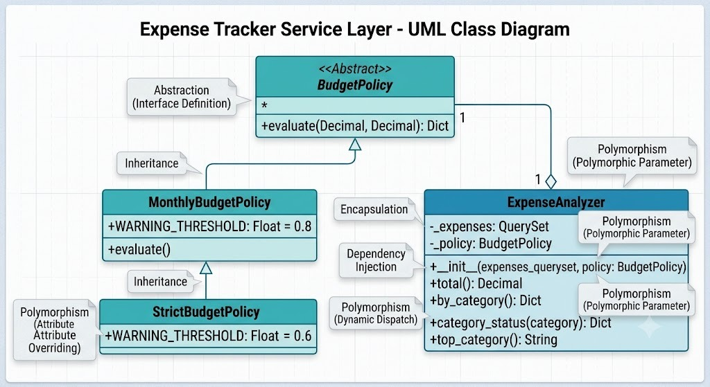
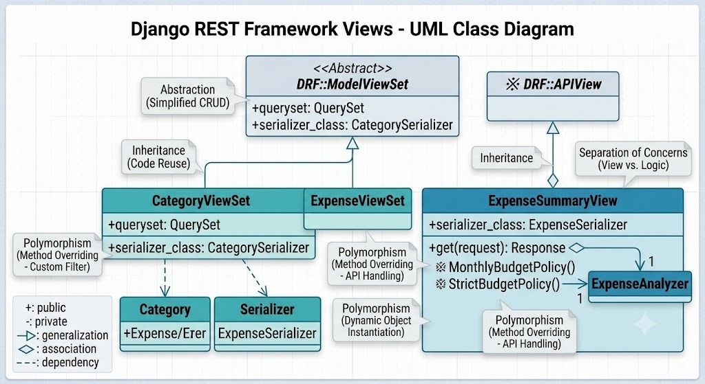

div align="center">
  
  
  

  <p><b>A beautifully crafted, Object-Oriented Full-Stack Finance Application solving Complex Computing Problems (CCP)</b></p>

  <p>
    
    
    
    
    
  </p>
</div>

<br/>

## 👨‍💻 Academic Context & Authors
This project was developed as the **Complex Computing Problem (CCP)** for the **CT-260 Object-Oriented Programming** course at **NED University of Engineering and Technology**. 

**Department:** Computer Science & Information Technology (CSIT)

This project was built collaboratively, with both team members working side-by-side across the entire stack—from system architecture and database modeling to full-stack development (React & Django) and OOP implementation.

* **Muzammil Ahmed** (Roll No: `CT-24307`)
* **Raza Ali** (Roll No: `CT-24308`)

---

## 🎯 Problem Statement & Objectives
Personal financial management is typically done via scattered spreadsheets or generic notes, leading to error-prone tracking with no real-time insights. 
The **Smart Expense Tracker** solves this by offering a persistent, queryable data model with automated budget-threshold alerts. 

**Objectives:**
* Apply core **OOP Principles** (Encapsulation, Inheritance, Polymorphism, Abstraction) to structure business logic.
* Provide a clean **REST API** separating frontend (React) and backend (Django) concerns using an MVT/MVC architecture.
* Allow dynamic category management and real-time expense reporting.

---

## ✨ Core Features
* 📊 **Smart Dashboard:** Real-time visual data mapping daily and weekly expenditure trends using Recharts.
* 🛡️ **Role-Based Security:** JWT authentication (SimpleJWT) for secure, private user sessions.
* 💰 **Dynamic Budgeting:** Assign specific limits to categories (e.g., Food, Rent).
* 🚨 **Automated Alert System:** Service-layer algorithms that warn you when crossing 60% or 80% of your budget.
* 📱 **Modern UI/UX:** A beautifully designed interface with glass-morphism hints, responsive sidebars, and fluid animations.

---

## 🎨 User Interface Gallery

<div align="center">
  <h3>🏠 Main Dashboard & Analytics</h3>
  
  
  <br/><br/>

  <table align="center" style="border-collapse: separate; border-spacing: 15px;">
    <tr>
      <td align="center"><b>🔐 User Authentication (Login)</b><br/></td>
      <td align="center"><b>📝 User Registration</b><br/></td>
    </tr>
    <tr>
      <td align="center"><b>🏷️ Category Management</b><br/></td>
      <td align="center"><b>💸 Expense Tracking Table</b><br/></td>
    </tr>
  </table>
</div>

---

## 🧠 Deep Dive: OOP Principles in Action
This application demonstrates industry-standard Object-Oriented design, avoiding "fat views" by shifting logic to models and specialized service classes.

### 1. Abstraction 
We defined an abstract base class `TimeStampedModel` in Django to hide boilerplate fields (`created_at`, `updated_at`). Furthermore, the `BudgetPolicy(ABC)` class enforces a strict contract (`evaluate()`) for budget checking without dictating the implementation.
```python
class BudgetPolicy(ABC):
    @abstractmethod
    def evaluate(self, spent: Decimal, budget: Decimal) -> dict:
        raise NotImplementedError
```

### 2. Inheritance
Django models (`Category`, `Expense`) inherit from `TimeStampedModel`. More impressively, our business rules use inheritance to tweak behavior: `StrictBudgetPolicy` inherits from `MonthlyBudgetPolicy`, overriding just the threshold attribute.
```python
class StrictBudgetPolicy(MonthlyBudgetPolicy):
    WARNING_THRESHOLD = 0.6  # Overrides parent's 0.8
```

### 3. Polymorphism & Dependency Injection
The `ExpenseAnalyzer` calculates category health dynamically. It accepts *any* object fulfilling the `BudgetPolicy` interface (Polymorphic parameter). The caller (`ExpenseSummaryView`) decides whether to inject a strict or standard policy at runtime.
```python
# In ExpenseAnalyzer
def category_status(self, category):
    # self._policy can be ANY policy. The correct evaluate() runs automatically.
    return self._policy.evaluate(Decimal(spent), category.monthly_budget)
```

### 4. Encapsulation
Data and behavior are kept together. The `Category` model encapsulates the logic to sum its own expenses, rather than making the view do the math. 
```python
class Category(TimeStampedModel):
    def total_spent_this_month(self):
        # Internal DB aggregation hidden behind a clean method call
        return self.expenses.filter(...).aggregate(Sum('amount'))
```

---

## 🏗️ System Architecture & UML Flow

Our system embraces a **Layered Architecture (MVC/MVT)**. React acts as the Presentation Layer, DRF acts as the API/Controller layer, and Django Models serve as the Data/Logic layer.

### 🔄 Complete System Flow Diagram
*Shows the end-to-end interaction from React Components ➔ DRF Views ➔ Serializers ➔ Services ➔ Models.*
<p align="center"></p>

### 🧩 Domain Models Class Diagram
<p align="center"></p>

### ⚙️ Service Layer (Polymorphism & Strategies)
<p align="center"></p>

### 📡 Django REST Framework Views
<p align="center"></p>

---

## 📂 File & Directory Structure

```text
EXPENSE-TRACKER/
├── backend/                        # Django API Backend
│   ├── manage.py
│   ├── db.sqlite3                  
│   ├── accounts/                   # Authentication Module (JWT)
│   ├── expense_tracker/            # Project Settings
│   └── tracker/                    # Core Business Logic Module (OOP Services)
├── docs/                           # Documentation & Assets
│   ├── home page.jpeg              
│   ├── full uml.jpeg               
│   └── ...                         # (UML diagrams and UI screenshots)
├── frontend/                       # React Presentation Layer
│   ├── public/
│   └── src/
│       ├── App.js                  # Main Application Shell
│       ├── api/                    # API Integration Layer
│       ├── components/             # Reusable UI Components
│       └── pages/                  # Routing Pages
├── Expense_Tracker_CCP_Report.docx # Official Project Report
└── README.md                       # Project Documentation
```

---

## 🚀 Installation & Setup Guide

### 1. Backend Setup (Django)
```bash
# Navigate to the backend directory
cd backend

# Create and activate a virtual environment
python -m venv .venv
source .venv/bin/activate  # On Windows: .venv\Scripts ctivate

# Install dependencies
pip install -r requirements.txt

# Run database migrations
python manage.py migrate

# Start the Django development server (runs on localhost:8000)
python manage.py runserver
```

### 2. Frontend Setup (React)
```bash
# Open a new terminal and navigate to the frontend directory
cd frontend

# Install Node dependencies
npm install

# Start the React development server (runs on localhost:3000)
npm start
```

---

## 🔮 Future Enhancements (Scope)
As outlined in our CCP Report, future iterations could include:
1. **Multi-Currency Support:** Adding an API to fetch live exchange rates.
2. **Strategy Pattern for Reports:** Pluggable formats allowing users to export data as PDF or CSV.
3. **Database Migration:** Upgrading from SQLite3 to PostgreSQL for higher concurrent production load.
4. **Bank Integrations:** Automating transaction imports via open banking APIs.

---

<div align="center">
  <b>🌟 Designed & Developed with <span style="color: #e25555;">&hearts;</span> by NED CSIT Students 🌟</b>
  <br/><br/>
  
</div>
